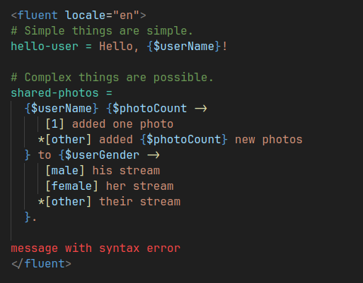

# fluent-vue

Syntax highlighting for Fluent syntax.

## Features

* Syntax highlighting in `.ftl` files
* Syntax highlighting in Vue `<fluent>` custom blocks from `fluent-vue`

## Release Notes

### 1.0.0

Initial release of fluent-vue.
Support syntax highlighting in `.ftl` files and in Vue `<fluent>` blocks.

---
